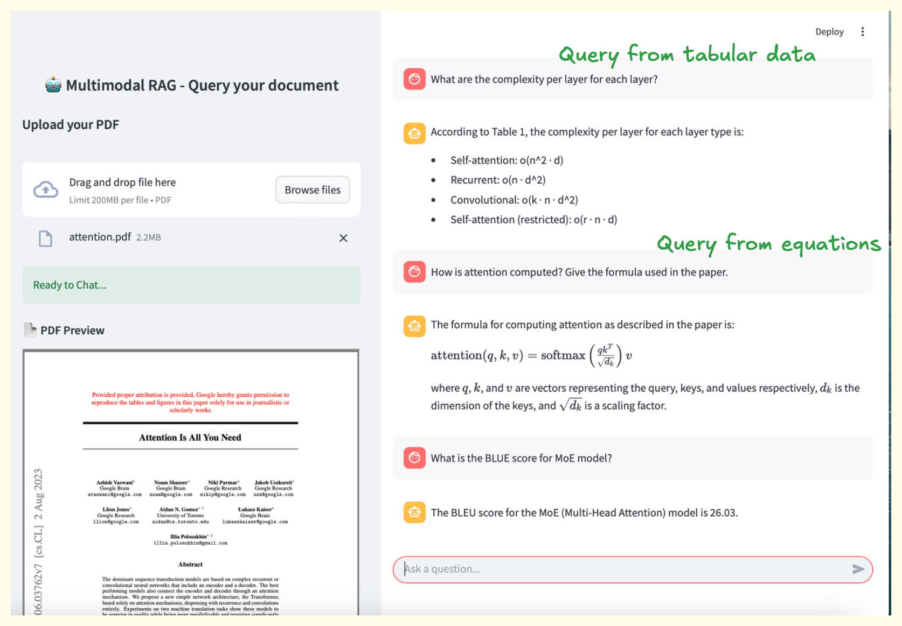

# Multimodal-RAG
Exam Trainer Agent lets you query your university notes in PDF format including text, tables and formulas using a Retrieval-Augmented Generation pipeline. It leverages Docling for structured PDF parsing and Qdrant for fast vector search over embedded document chunks. 


## What This Project Does
Link to Medium article reference: [Docling-Powered RAG: Querying Over Complex PDFs](https://medium.com/@pritigupta.ds/docling-powered-rag-querying-over-complex-pdfs-d99f5f58bc33)

This project is a **Streamlit-based application** on multimodal RAG that lets users:

* Upload a PDF document
* Extract structured **markdown using [Docling](https://github.com/microsoft/docling)**
* Replace embedded images with summaries
* Split the content into fixed length chunks
* Generate embeddings using `nomic-embed-text-v1.5`
* Store and index embeddings into a Qdrant vector database
* Use `GPT-5` provided by Azure AI Foundry
* Enable chat-based querying through a RAG pipeline

All of this runs **locally**, with a clean UI and persistent chat history.



## File Structure

```
docs/
|   ├── analisi1.pdf        # Test pdf for querying

src/
│   ├── chunk_embed.py       # Tokenization, chunking, and embedding
│   ├── index.py             # Qdrant Vector DB wrapper
│   ├── retriever.py         # Retriever class to fetch relevant chunks
│   ├── rag_engine.py        # RAG class combining retriever + LLM
│   └── utils.py             # Docling markdown + summary replacements

images/
│   ├── screenshot.png       # Interface screenshot

output/
│   ├── output.md            # Raw markdown output from Docling

app.py                    # Main Streamlit app
README.md                 # You're reading it
```

---

## How It Works

1. **PDF Upload**: Users upload a PDF in the sidebar.
2. **Docling**: PDF is converted to markdown (with layout + tables + image data).
3. **Chunking + Embedding**:

   * Tokenized into 1024-token overlapping chunks.
   * Embedded using `nomic-embed-text-v1.5`.
4. **Indexing**: Embeddings are stored in a **Qdrant vector DB**.
5. **Querying**:

   * User queries are embedded.
   * Top-7 relevant chunks are retrieved using **dot-product similarity**.
   * These are passed to **GPT-5** for final answer generation.


## Demo (Local Setup)

1. **Install Docker from the official website**  
   You can install Docker following the instructions on the [official Docker website](https://www.docker.com/get-started) or refer to the [Visual Studio Code Containers guide](https://code.visualstudio.com/docs/containers/overview) for setting up Docker integration in VS Code.

2. **Install dependencies**:

   ```bash
   pip install -r requirements.txt
   ```

3. **Start Qdrant locally using Docker**
   Qdrant is used for vector storage and similarity search. You can find the official Qdrant image and detailed setup instructions on [Docker Hub](https://hub.docker.com/r/qdrant/qdrant).

   Then run the following command to start Qdrant locally:

   ```bash
   docker run -p 6333:6333 qdrant/qdrant
   ```

4. **Run the app**:

   ```bash
   streamlit run app.py
   ```


## References

* [Docker](https://www.docker.com/get-started)
* [Docling](https://github.com/docling-project/docling)
* [Streamlit Chat UI](https://docs.streamlit.io/develop/tutorials/chat-and-llm-apps/build-conversational-apps)
* [Qdrant Vector DB](https://qdrant.tech/)
* [nomic-embed-text-v1.5](https://huggingface.co/nomic-ai/nomic-embed-text-v1.5)
